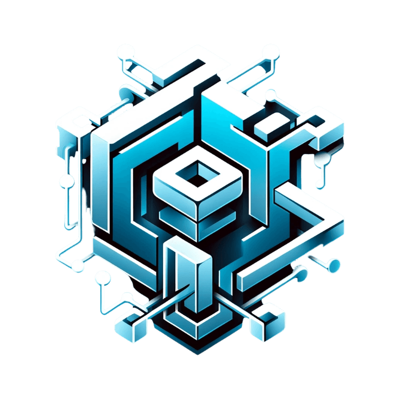

    

# FOS - Network

## Introduction

Welcome to FOS, a project designed to champion the unbridled exercise of freedom of speech through the innovative use of IPFS (InterPlanetary File System) and blockchain technology. Our mission is to create a platform where voices can be heard without fear of censorship or retribution, ensuring that every opinion and expression is valued and preserved.

## Features

- **Immutable Content Storage:** Leveraging IPFS and blockchain technology, FOS ensures that all content is stored permanently, making censorship or alteration of authors' work impossible.
- **Decentralized Platform:** With decentralization at its core, FOS provides a robust and resilient platform immune to centralized control and interference.
- **Transparent Operations:** Every transaction and submission is transparently recorded on the blockchain, promoting a culture of openness and trust.
- **User Empowerment:** FOS is built to empower users, providing a safe space for free expression without fear of censorship or cancel culture.

## How It Works

1. **Anonymous Accounts:** Users log in with an Ethereum address/wallet of their choice.
2. **Content Submission:** Users can submit their content to the FOS platform.
3. **IPFS Storage:** Submitted content is stored on IPFS, ensuring decentralized and permanent storage.
4. **Blockchain Recording:** Each content submission is recorded as a transaction on the blockchain, providing an immutable record of existence.

## Getting Started

To get started with FOS:

1. **Create an Account:** Connect your wallet to participate and start submitting your content.
2. **Explore and Engage:** Search for other addresses to follow and see their posts and submissions.

## Contributing

We welcome contributions from everyone. If you're interested in improving FOS, please reach out to us.

---

Embrace your freedom of speech with FOS - a platform where every voice matters.

---

## To-Do's